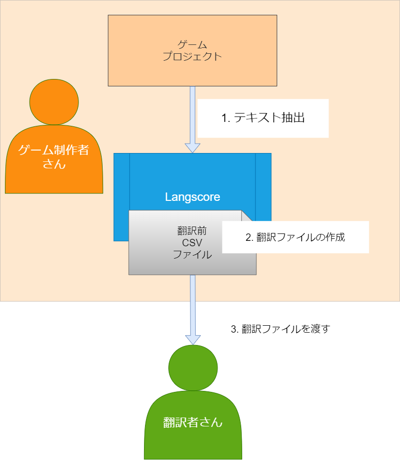
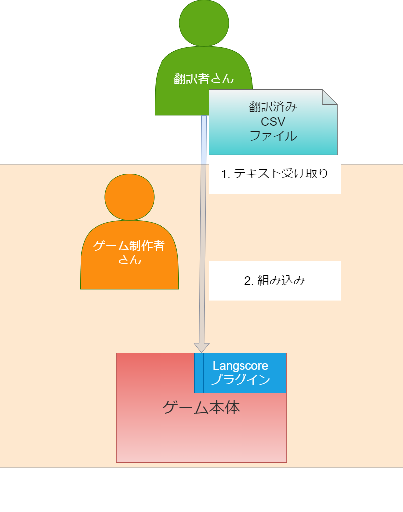
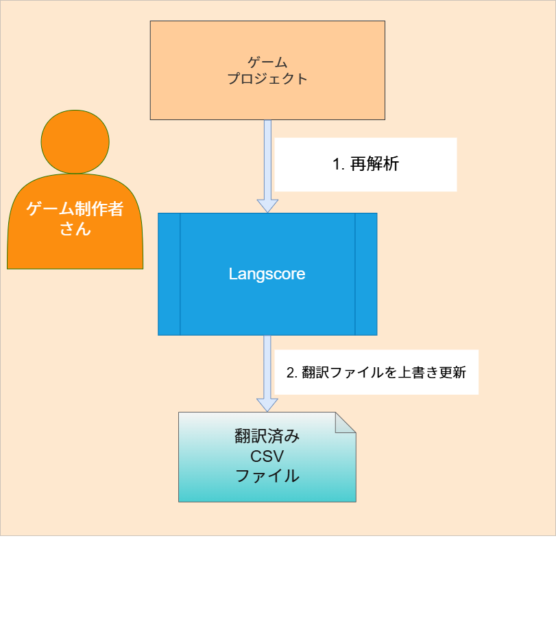

.. _workflow:

ワークフロー 
#############

Langscoreを使用してゲームを翻訳するまでの流れは以下のようになります。

初めて導入するときの作業
************************

翻訳者に翻訳用CSVを渡すまで
--------------------------------

ゲーム制作者の方はLangscoreを使用して、ゲームからテキストの抽出・翻訳CSVの作成を行います。
翻訳者の方には作成したCSVを渡してください。

翻訳作業
------------------

CSVファイルはExcelやGoogleスプレッドシートで編集することが出来ます。

Office360やGoogleドライブに上げることで、共同作業等も可能です。

翻訳済みCSVをゲームに組み込むまで
---------------------------------

翻訳が完了したCSVは、ゲームプロジェクトの所定の場所に置くことでプラグインが読み込みます。

翻訳作業の際に行うことで、ゲームをプレイして翻訳を確認することも可能です。

ゲームをバージョンアップして文章が追加・編集された場合
******************************************************

Langscoreで :ref:`reanalysis` を行い、翻訳済みCSVを上書きします。

Langscoreで翻訳CSVを上書きすると、既に翻訳済みの箇所は消されずに残したまま、新しい文章を追加することが出来ます。
上書きしたCSVを、再度翻訳者の方に渡して下さい。

