.. _screen_description_edit:

各画面の説明(翻訳ファイル作成モード)
####################################

解析ダイアログ
--------------

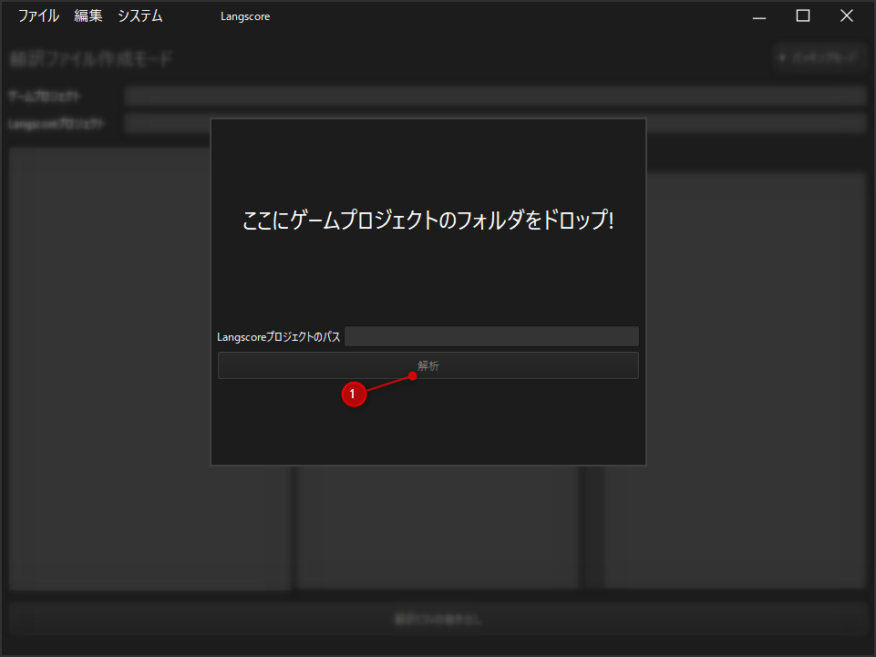

1. 解析ボタン

   ゲームプロジェクトフォルダをこの画面にドラッグ＆ドロップしてください。

   正しくフォルダを読み込めた場合、「Langscoreプロジェクトパス」に出力先のパスが表示されます。

   既にプロジェクトが作成済みの場合、翻訳ファイル作成モードに移行します。

翻訳ファイル作成モード
----------------------

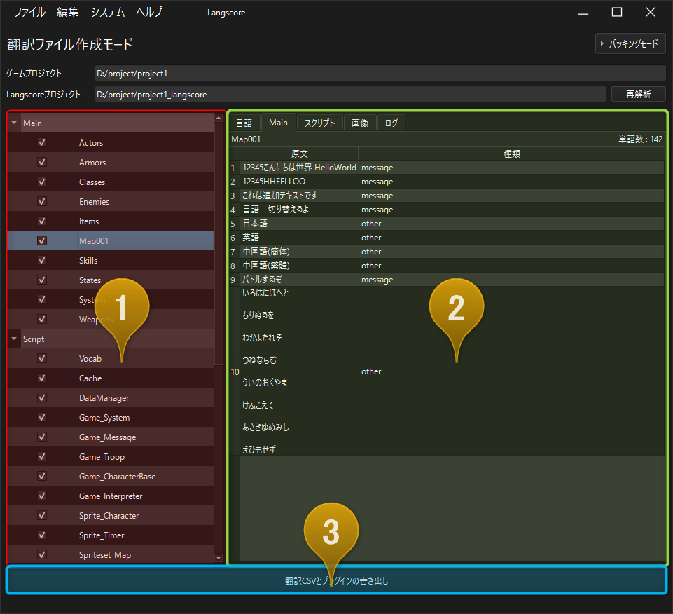

1. 翻訳ファイルツリー
   
   - 翻訳に関わるファイルを一覧できます。
   
   - 項目をクリックすると、その内容を翻訳ファイルプレビューに表示します。
   
   - 左のチェックを外すと、翻訳ファイルを書き出さなくなります。

2. 情報ウィンドウ

   - 5種類のウィンドウを切り替えて表示することが出来ます。(下記参照)

3. 書き出しボタン

   - 翻訳ファイルを書き出し、プラグインを追加します。

   - 一度書き出した場合、ボタンが分離します。

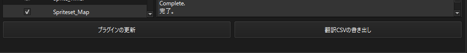

情報ウィンドウの種類
--------------------

言語
^^^^

翻訳対象の言語を選択することが出来ます。

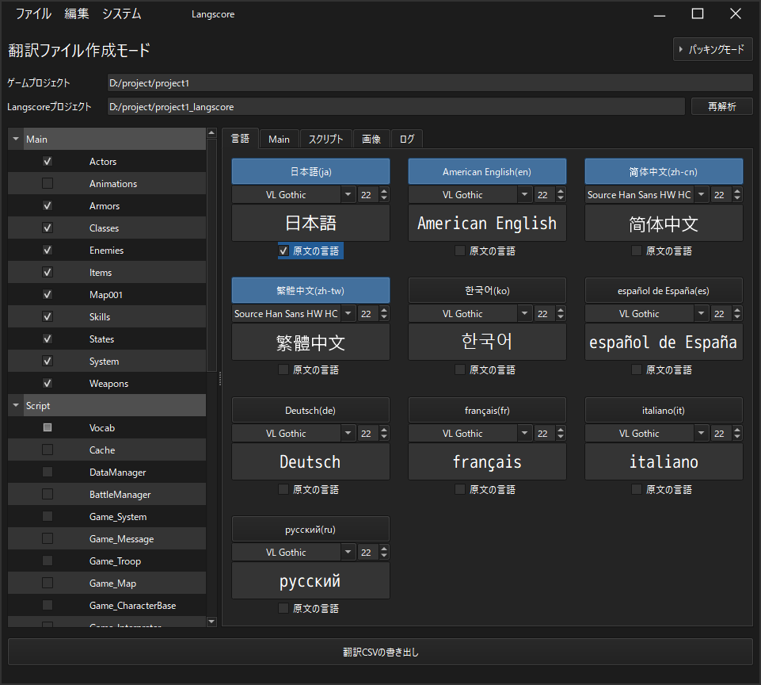

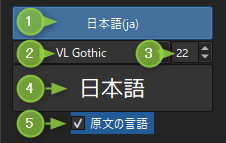

1. 言語の有効無効ボタン
2. ゲームで使用するフォント
3. フォントサイズ
4. フォントの簡易プレビュー
5. 原文の言語チェック

.. attention:: 原文の言語チェックは、必ずゲーム制作時に使用した言語を選択してください。  
   この設定は原文が何語かを判定する際に使用しているため、異なる言語にチェックを付けると正しく翻訳されない可能性があります。

Main
^^^^

選択したデータ内の文章を確認することが出来ます。
マップのデータやアクター・職業・アイテムといった、基本的なテキストがMainに分類されます。

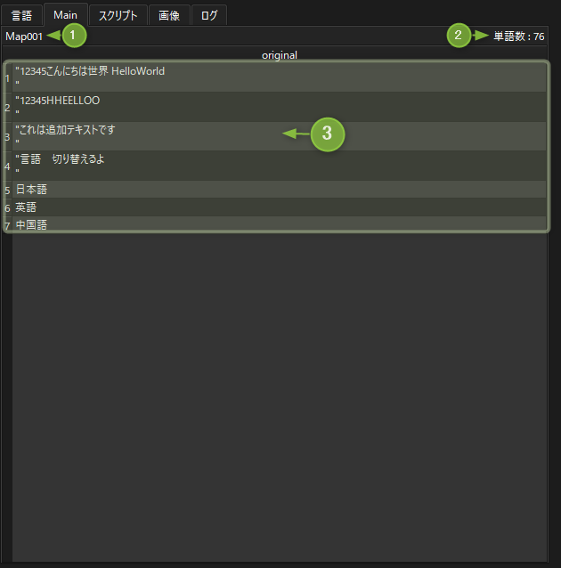

1. 選択したデータ名
2. データ内の文字数(ざっくり)
3. 文章の内容

スクリプト
^^^^^^^^^^

スクリプト(プラグイン)に含まれるテキストが含まれます。

* VX Ace
 
 - 戦闘中のバフ・デバフテキストやショップのテキストはここに含まれます。

* MV/MZ
 
 - プラグインパラメータ内のテキストも含まれます。
 
 - プラグインパラメータの場合は TextPoint に / 区切りの文字が表示されます。

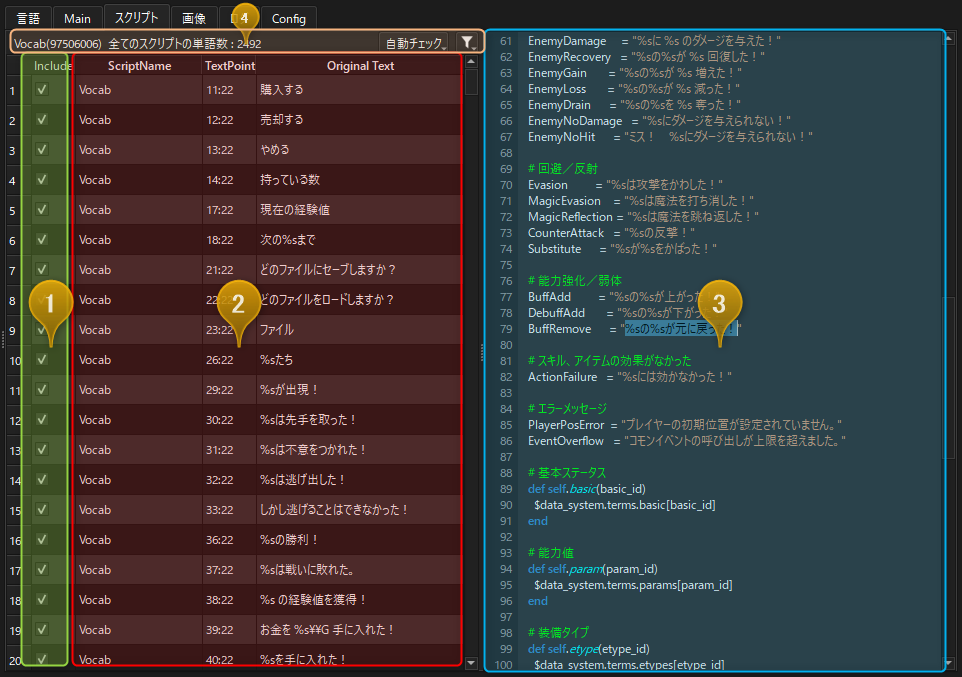

1. 翻訳に含めるかのチェック
   - チェックを外すとlangscore_customに情報が書き出されなくなります。
2. 該当するスクリプトの場所
   - 左から「スクリプト名」「行・列番号」「文字列（内容）」になります。
3. 簡易スクリプトプレビュー
4. 情報・メニュー欄

 * 選択した行のスクリプト名
 * スクリプトの単語数(ざっくり)
 * 自動チェックメニュー
 * 表示フィルターメニュー

.. _screen-auto-check-menu_edit:

自動チェックメニュー
~~~~~~~~~~~~~~~~~~~~~~~~~~

* 記号のみのテキストのチェックを外す

 - "Original Text" 列を検索し、 , や :: といった記号 **しか無い** 行のチェックを外します。

* 日本語を含まない文章のチェックを外す

 - "Original Text" 列を検索し、 日本語(ひらがな・カタカナ・漢字)を **含まない** 行のチェックを外します。

表示フィルターメニュー
~~~~~~~~~~~~~~~~~~~~~~~~~~~~

* 全ての内容を表示
  - 全ての内容が表示されます。

* 無視にした内容を非表示
  - Include列のチェックが外れている行が非表示になります。

画像
^^^^

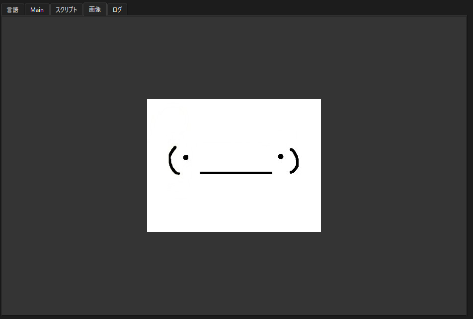

ツリーで選んだ画像がプレビュー表示されます。

翻訳対象に含める際の確認にご利用ください。

ログ
^^^^

書き出し時のログを雑に出力しています。

不具合等があった場合、このログを頂けると大変助かります。

書き出しダイアログ
------------------

初回書き出し時
^^^^^^^^^^^^^^^^^^^^^^

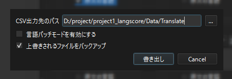

* 言語パッチモードを有効にする

 - :ref:`言語パッチ機能 <language_patch>` を有効にします。

* 上書きされるファイルをバックアップ

 - plugins.jsなど、プラグインの追加時に書き換えるファイルのバックアップを取ります。

プラグインの更新 (2回目以降)
^^^^^^^^^^^^^^^^^^^^^^^^^^^^^^^^^^

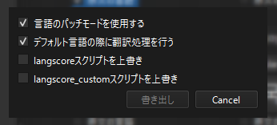

   
* 言語パッチモードを使用する

 - :ref:`言語パッチ機能 <language_patch>` を有効にします。

* Translation process in default language

 - 「デフォルト言語使用時に言語処理を行う」かのチェックです。
 - チェックを外すと、デフォルト言語使用時は翻訳処理を ``行いません`` 。
   
* langscoreスクリプトを上書き

 - プラグインを更新します。バージョンを上げる場合に使用して下さい。

* langscore_customスクリプトを上書き

 - langscore_customを上書きします。既に書き込んでいる場合、内容が初期化されますので注意して下さい。

翻訳CSVの更新 (2回目以降)
^^^^^^^^^^^^^^^^^^^^^^^^^^^

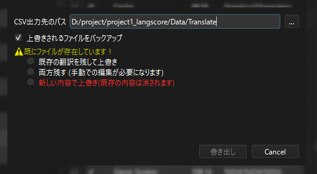
   
* 言語パッチモードを使用する

 - :ref:`言語パッチ機能 <language_patch>` を有効にします。
 - 有効にした場合、出力先のフォルダに更に言語フォルダが作成されます。CSVは言語フォルダ内に格納されます。

* 上書きされるファイルをバックアップ

 - 既存の翻訳CSVファイルのバックアップを取ります。

上書き確認について
^^^^^^^^^^^^^^^^^^

書き出し先にCSVが存在する場合、上書きの確認を行わないと書き出すことが出来ません。

既存の翻訳を残して上書き
~~~~~~~~~~~~~~~~~~~~~~~~~~~~~~~~

翻訳された文章がある行は何も変更しません。
また、翻訳CSVに無いテキストは新しい行で書き出されます。

.. image:: img/write_dialog2.png

   
バックアップについて
^^^^^^^^^^^^^^^^^^^^^^^^^

有効にした場合、以下のファイル・フォルダを"(プロジェクト名)_langscore/backup"に保存します。

- Script.rvdata ファイル
- Translateフォルダ (翻訳書き出し後に作成)

バックアップフォルダは日時を付与するため、バックアップ同士で上書かれることはありません。

制限なく書き出して自動削除もしていませんので、不要な場合は折を見て手動で削除してください。
