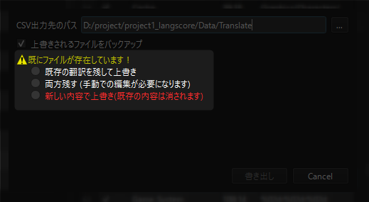

.. _usage_advance:

応用的な使い方(ツール)
########################################

ざっくりとした内容は :ref:`基本的な使い方 <basic_usage>` をご覧ください。

言語選択
********


言語で使用するフォントを追加する
================================


「翻訳ファイル生成モード」が表示されているときに、フォントファイルをドラッグ&ドロップすることで、フォントを追加することが出来ます。

対応フォントは.ttf, .otfの2種類です。

フォントを追加した場合、再起動するまで「フォントのプレビュー」にフォントは反映されません。

追加したフォントはlangscoreプロジェクトフォルダ内のFontsに格納されます。

CSVファイルの書き出しと同時に、ゲームプロジェクトフォルダ内のFontsフォルダにコピーします。

ローカルフォントとグローバルフォント
------------------------------------

**ローカルフォント**

ドラッグ&ドロップで追加したフォントはローカルフォントとして扱われます。

ローカルフォントは1プロジェクトのみで使用することが出来ます。


**グローバルフォント**

しかし、複数のプロジェクトで同じフォントを使用したい場合、一々ドラッグ&ドロップするのは手間があります。

この手間を省き、常にLangscoreで使用できるようにするのがグローバルフォントです。

グローバルフォントにするには以下のフォルダにフォントファイルを置きます。

```langscore.exeのあるフォルダ/resources/fonts```


スクリプト内のテキストで、翻訳するものを絞る
============================================


スクリプトによっては、ゲーム中で表示される文章が内部に書かれている場合があります。ほとんどの文章は翻訳する必要はありませんが、稀によく翻訳が必要になる箇所があります。


翻訳が不要な行の場合、ハイライトした列のチェックを外してください。

スクリプトごと不要にしたい場合は、左側のツリーでチェックを外すと、そのスクリプトのテキストは翻訳CSVから除外されます。


スクリプト内のテキストを翻訳する場合、更にプログラム側の対応が必須になります。詳細は :ref:`応用的な使い方(VX Ace向けのプログラム編) <usage_advance_script_vxace>` をご覧ください。


ゲームプロジェクトのアップデートに追従する
==========================================

新規シナリオの追加や誤字脱字の修正等で、ゲームプロジェクトが更新された時の手順を説明します。


プロジェクトの再解析
--------------------


ゲームプロジェクト側の内容を再度反映させるには、編集モード画面右上の「再解析」ボタンを押します。


再解析を行うと、Langscore上の既存の内容が更新されます。

.. warning:: 上書きした内容は復元できません。


翻訳ファイルの上書き
--------------------




既に翻訳ファイルを完成させている場合、上書きしようとすると上記のような画面が表示されます。

「新しい内容で上書き」以外を選んだ場合の挙動は以下のようになります。

* 原文(original行)は全て保持されます。

  * ゲームから古い文章が消されていても、CSVには引き継がれます。

ゲームから削除した文章をCSVからも削除したい場合は、WinMerge等のDiffツールで差分を確認することを推奨します。


画像を変える
============

画像の検索方法は2通りあります。

1. Graphics.csvから使用する画像ファイルパスの読み込み。
2. Graphics.csvで画像ファイルパスが見つからない場合[ファイル名_言語名]となるファイルを検索。

上記の処理でも見つからない場合、元の画像を表示します。

詳解:1.
---------


以下の画像ファイルを翻訳する場合を例とします。

.. code-block::

	Picture/TitleLogo.png


翻訳対象が英日中の場合、CSVには以下のように記述します。

.. csv-table::
	:header: "original","en","ja","zh-cn"
	:align: left
	
	./Picture/TitleLogo.png,Picture/TitleLogo_2.png,Picture/TitleLogo.png,Picture/TitleLogo_3.png


詳解:2.
-------

.. warning:: MV/MZにおいて、2.の方法は.exeで配布する場合のみ使用可能です。ブラウザでは1.のみの対応のためご注意ください。

翻訳先が空の場合、ファイルパスから検索します。


.. csv-table::
	:header: "original","en","ja","zh-cn"
	:align: left
	
	./Picture/TitleLogo.png,,./Picture/TitleLogo.png,


* 英語表示の場合

  - ./Picture/TitleLogo_en.png

* 日本語表示の場合

  - パスが書かれているので、CSVの内容を適用

* 中国語(簡体)表示の場合

  - ./Picture/TitleLogo_zh-cn.png

英・中の場合、TitleLogo_(lang).pngが見つからない場合はTitleLogo.pngを表示します。


